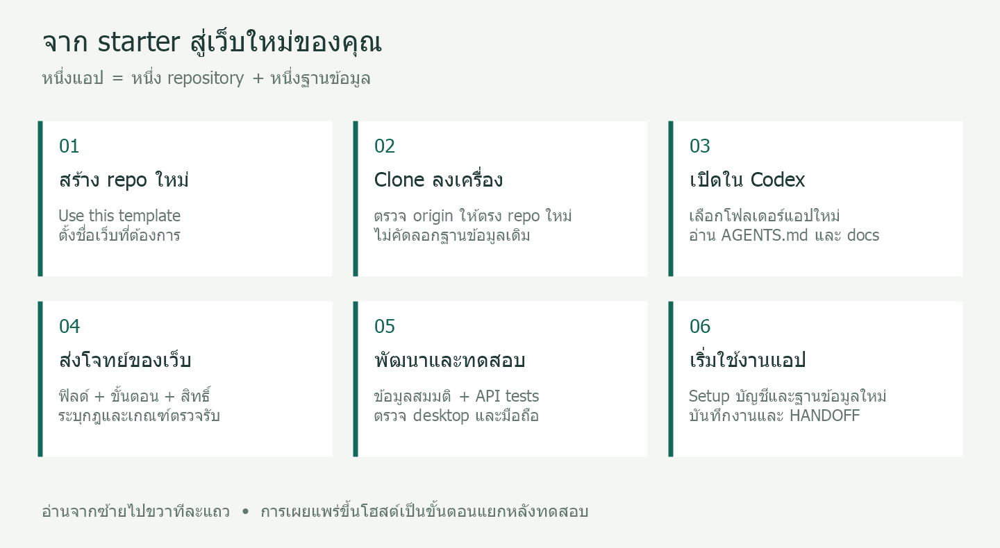
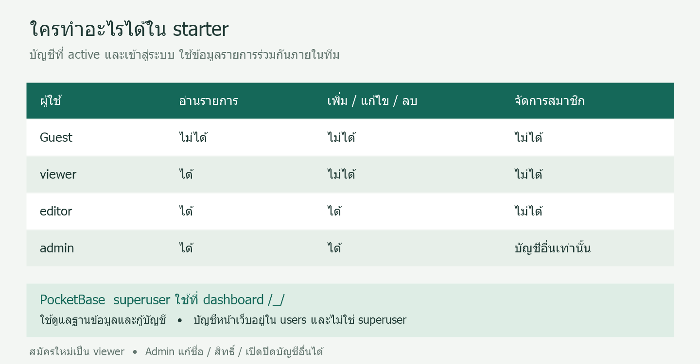

# คู่มือใช้ pb-crud-app-starter สร้างเว็บใหม่

คู่มือภาษาไทย • ตรวจสอบกับโค้ดวันที่ 26 กันยายน 2026

`pb-crud-app-starter` เป็นชุดเริ่มต้นสำหรับเว็บที่มีฟอร์ม ฐานข้อมูล สมาชิก และผู้ดูแลระบบ ใช้ HTML/CSS/JavaScript + PocketBase + SQLite คำว่า bootstrap ในคู่มือนี้หมายถึงการตั้งต้นโปรเจค ไม่ใช่ Bootstrap CSS framework

**เส้นทางแนะนำ:** สร้าง repo ใหม่จาก template → clone ลงเครื่อง → เปิดโฟลเดอร์ใหม่ใน Codex → ส่งความต้องการ → ทดสอบ → สร้างฐานข้อมูลใช้งานของแอปนั้น



*ภาพประกอบขั้นตอน ไม่ใช่ภาพหน้าจอของ GitHub หรือ Codex*

## สารบัญ

- [1. สิ่งที่มีให้แล้ว](#included)
- [2. เตรียมเครื่องและสร้าง repo ใหม่](#new-repo)
- [3. เปิดโปรเจคใน Codex หรือเตรียมโจทย์ใน ChatGPT](#codex)
- [4. ติดตั้งและเปิดใช้งานครั้งแรก](#setup)
- [5. ทดลองใช้ฟอร์มและหน้า admin](#usage)
- [6. ตัวอย่างต่อยอดเป็นเว็บจริง](#examples)
- [7. วงจรทำงานกับ AI และการส่งต่องาน](#iteration)
- [8. ปัญหาที่พบบ่อย](#troubleshooting)
- [คลัง prompt พร้อมคัดลอก](PROMPT-EXAMPLES.md)

<a id="included"></a>
## 1. สิ่งที่มีให้แล้ว

| ส่วน | ความสามารถปัจจุบัน |
| --- | --- |
| หน้าเว็บ | ภาษาไทย รองรับ desktop และมือถือ ไม่มีขั้นตอน build |
| สมาชิก | สมัครสมาชิก เข้าสู่ระบบ ออกจากระบบ |
| รายการงาน | เพิ่ม ดู แก้ไข ลบ ค้นหาชื่อ/รายละเอียด กรองสถานะ แบ่งหน้า |
| ฟอร์ม | ชื่อ จำนวน วันที่กำหนด สถานะ และรายละเอียด |
| Admin | ดูสมาชิก เปลี่ยนชื่อ/สิทธิ์ เปิดหรือปิดบัญชีอื่น |
| Backend | PocketBase 0.39.8 ตาม version ที่ pin ใน scripts, ฐานข้อมูล SQLite, API rules และ validation |
| เครื่องมือ | Scripts สำหรับ Windows/Linux/macOS และ integration test ที่ใช้ข้อมูลชั่วคราว |

ฟอร์มกำหนดฟิลด์ในโค้ด ยังไม่มีตัวสร้างฟอร์มแบบลากวาง ระบบอีเมลกู้รหัสผ่าน หน้า audit log หรือการแยกองค์กรหลาย tenant สิ่งเหล่านี้สามารถสั่งพัฒนาเพิ่มได้



*ภาพอธิบายสิทธิ์ของ starter ปัจจุบัน ทุกบัญชีที่ active และเข้าสู่ระบบอ่านรายการทั้งหมดร่วมกันได้*

ผู้สมัครใหม่เป็น active viewer เสมอ และยังไม่ต้องยืนยันอีเมลเพื่ออ่านข้อมูล ถ้าแอปใหม่ต้องเห็นเฉพาะรายการของตนเอง หรือรับสมาชิกเมื่อผู้ดูแลอนุมัติ ต้องระบุเพิ่มในโจทย์ก่อนใช้งานจริง ดู [ขอบเขตความปลอดภัย](SECURITY.md)

<a id="new-repo"></a>
## 2. เตรียมเครื่องและสร้าง repo ใหม่

เตรียม Git, PowerShell บน Windows หรือ Bash/curl/unzip บน Linux/macOS และ Codex ที่เข้าถึงโฟลเดอร์โปรเจคได้ หากจะรัน `tests/integration.mjs` ต้องมี Node.js 22 ขึ้นไป การเปิดแอปตามปกติไม่ต้องใช้ Node.js

### 2.1 ตั้ง repo ต้นแบบครั้งเดียว

1. เปิด [pb-crud-app-starter บน GitHub](https://github.com/insthync/pb-crud-app-starter)
2. ตรวจว่าไฟล์ source ล่าสุดถูก commit และ push แล้ว
3. เจ้าของ repo เปิด **Settings → Template repository** หากยังไม่ได้เปิด

### 2.2 สร้าง repo ของเว็บใหม่

1. ที่หน้า template กด **Use this template → Create a new repository**
2. ตั้งชื่อ เช่น `equipment-borrowing` แล้วเลือก owner และ visibility ที่ต้องการ
3. สร้าง repo แล้วคัดลอก clone URL จากหน้า repo ใหม่นั้น

Repo ที่สร้างจาก template มีประวัติของตนเอง การแก้ starter ภายหลังไม่อัปเดตแอปลูกให้อัตโนมัติ ต้องเลือกนำการเปลี่ยนแปลงมาปรับและทดสอบในแต่ละแอป ดู [GitHub: สร้าง repository จาก template](https://docs.github.com/en/repositories/creating-and-managing-repositories/creating-a-repository-from-a-template)

ตัวอย่าง Windows — แทน `YOUR_USERNAME` ด้วย owner จริง และสร้าง repo ตามชื่อในตัวอย่างก่อน:

```powershell
Set-Location D:\Projects\WebApps
git clone https://github.com/YOUR_USERNAME/equipment-borrowing.git
Set-Location equipment-borrowing
git remote -v
git status --short
```

ผลที่ควรได้: `origin` ชี้ไป repo ใหม่ และโฟลเดอร์มี `AGENTS.md`, `public/`, `scripts/`, `pocketbase/`, `docs/` การ clone ดึงเฉพาะไฟล์ที่อยู่ใน Git จึงยังไม่มีฐานข้อมูลและบัญชีของแอปใหม่

ถ้าใช้ local โดยไม่ผ่าน GitHub ให้ทำตาม [CUSTOMIZE.md](CUSTOMIZE.md) เพื่อคัดลอกเฉพาะ source ไม่คัดลอก `.git`, `pb_data`, credentials หรือ backups ของแอปอื่น

<a id="codex"></a>
## 3. เปิดโปรเจคใน Codex หรือเตรียมโจทย์ใน ChatGPT

### ใช้ Codex ทำงานกับไฟล์

เพิ่ม local project แล้วเลือกโฟลเดอร์ repo ใหม่ เช่น `D:\Projects\WebApps\equipment-borrowing` เป็นโฟลเดอร์หลัก เริ่มแชตภายในโปรเจคนั้น เพื่อให้บริบทของไฟล์และ Git อยู่ในแอปที่กำลังสร้าง ชื่อเมนูอาจแตกต่างตามรุ่นของแอป ดู [OpenAI: Projects and chats](https://learn.chatgpt.com/docs/projects)

หากติดตั้ง Codex CLI อยู่แล้ว สามารถเปิดจาก terminal ได้:

```powershell
Set-Location D:\Projects\WebApps\equipment-borrowing
codex
```

ใน starter มี `AGENTS.md` สำหรับกำหนดแนวทางทำงาน และ `docs/HANDOFF.md` สำหรับสถานะล่าสุด Codex อ่าน `AGENTS.md` ตามขอบเขตโฟลเดอร์ จึงควรเก็บคำแนะนำของแอปไว้ใน repo นั้น ดู [OpenAI: AGENTS.md](https://learn.chatgpt.com/docs/agent-configuration/agents-md)

เริ่มด้วย prompt สั้นนี้ แล้วแทนช่องวงเล็บให้ครบ:

```text
โปรเจคนี้สร้างจาก pb-crud-app-starter
อ่าน AGENTS.md, README.md, docs/INDEX.md และ docs/HANDOFF.md
ตรวจ git status และโค้ดจริงก่อนเริ่ม

สร้างเว็บชื่อ [ชื่อโปรเจค] สำหรับ [ผู้ใช้งานและปัญหาที่ต้องการแก้]
หน้าที่ต้องมี: [รายชื่อหน้าจอ]
ข้อมูลที่ต้องเก็บ: [ฟิลด์และชนิดข้อมูล]
ขั้นตอนทำงาน: [เริ่มต้น → ดำเนินการ → จบงาน]
สิทธิ์: [แต่ละ role อ่าน/เพิ่ม/แก้ไข/ลบอะไรได้]
การมองเห็นข้อมูล: [ใช้ร่วมกันทั้งทีม / เฉพาะเจ้าของ / แยกองค์กร]
กฎสำคัญ: [สิ่งที่ระบบต้องยอมรับหรือปฏิเสธ]

คง stack เดิม UI ภาษาไทย ระบบสมาชิกและ admin
พัฒนาจนทดลองใช้งานได้ ใช้ข้อมูลสมมติและฐานข้อมูลชั่วคราวในการทดสอบ
ปรับ tests ให้ตรงกับ schema ใหม่ ตรวจ API และหน้าจอ desktop/mobile
อัปเดต README และ docs/HANDOFF.md พร้อมสรุปวิธีเปิดใช้งาน
```

ตัวอย่างที่กรอกครบสำหรับงานแจ้งซ่อมและยืมคืนอุปกรณ์อยู่ใน [คลัง prompt](PROMPT-EXAMPLES.md)

### ใช้ ChatGPT ช่วยเตรียมโจทย์

เริ่มจากบอกปัญหา กลุ่มผู้ใช้ และตัวอย่างงานหนึ่งรายการ ให้ช่วยสรุปเป็นข้อกำหนด แล้วนำไปให้ Codex ทำงานต่อ แนบ README หรือเนื้อหาที่เกี่ยวข้องหากต้องการให้ ChatGPT เข้าใจ starter

ChatGPT Project ทั่วไปไม่ได้เข้าถึงโฟลเดอร์ในเครื่องอัตโนมัติ ต้องแนบไฟล์หรือเชื่อมแหล่งข้อมูล ส่วน local project ที่ผูกโฟลเดอร์ไว้สามารถให้บริบทไฟล์แก่เครื่องมือที่รองรับได้ ดู [OpenAI: Projects and chats](https://learn.chatgpt.com/docs/projects)

<a id="setup"></a>
## 4. ติดตั้งและเปิดใช้งานครั้งแรก

คำสั่งต่อไปนี้ใช้กับ repo ใหม่ที่ต้องการเริ่มฐานข้อมูลใช้งานของตนเอง ถ้าให้ Codex ทดลองแก้โค้ดก่อน ให้ใช้ฐานข้อมูลชั่วคราวตาม `AGENTS.md`

### Windows

เปิด PowerShell ในโฟลเดอร์ repo ใหม่:

```powershell
./scripts/setup-pocketbase.ps1
./scripts/start-pocketbase.ps1
```

### Linux / macOS

```bash
bash scripts/setup-pocketbase.sh
bash scripts/start-pocketbase.sh
```

Setup ดาวน์โหลด PocketBase ถ้าจำเป็น รัน migrations แล้วถามอีเมลและรหัสผ่านสองบัญชี:

| บัญชี | ใช้ที่ไหน | หน้าที่ |
| --- | --- | --- |
| PocketBase superuser | `http://127.0.0.1:8090/_/` | ดูแลฐานข้อมูล/ระบบและกู้บัญชี |
| Initial staff (ค่าเริ่มต้น admin) | `http://127.0.0.1:8090/` | ใช้งานเว็บและจัดการสมาชิก |

ใช้บัญชีแอปล็อกอินหน้าเว็บ กรอกรหัสผ่านใน terminal ตอน setup ถาม ไม่ต้องใส่ใน prompt หรือเอกสาร

เมื่อ start สำเร็จ เปิด `http://127.0.0.1:8090/` หยุดด้วย Ctrl+C ครั้งต่อไปใช้เฉพาะ start ได้ ฐานข้อมูลอยู่ใน `pocketbase/pb_data` ของแอปนั้น การรัน setup ซ้ำด้วยอีเมลเดิมจะเปลี่ยนข้อมูลบัญชีและรหัสผ่านตามค่าที่กรอกใหม่

### เปิดหลายโปรเจคพร้อมกัน

แต่ละแอปต้องใช้ port และ data directory ของตนเอง ตัวอย่างเปิดแอปที่สองที่ 8092:

```powershell
./scripts/start-pocketbase.ps1 -HttpAddress 127.0.0.1:8092
```

หรือบน Bash:

```bash
bash scripts/start-pocketbase.sh --http 127.0.0.1:8092
```

เปิด `http://127.0.0.1:8092/` ได้เลย เพราะ config เริ่มต้นใช้ origin ของหน้าเว็บ หาก port ชั่วคราวของ setup ที่ 8091 ถูกใช้ ให้กำหนด `-BootstrapHttpAddress 127.0.0.1:8093` หรือ `--bootstrap-http 127.0.0.1:8093`

<a id="usage"></a>
## 5. ทดลองใช้ฟอร์มและหน้า admin

### เพิ่มและแก้ไขรายการแรก

1. เข้าสู่ระบบด้วยบัญชีแอป admin ที่สร้างตอน setup
2. กด **+ เพิ่มรายการ**
3. กรอกชื่อ `ตรวจอุปกรณ์ห้องประชุม` จำนวน `2` วันที่กำหนดที่ต้องการ สถานะ `รอดำเนินการ` และรายละเอียด `ตรวจสายสัญญาณและรีโมต`
4. กด **บันทึก** แล้วค้นหาคำว่า `ห้องประชุม`
5. กด **แก้ไข / ดู** เปลี่ยนสถานะเป็น `เสร็จแล้ว` และบันทึก เปิดดูอีกครั้งเพื่อยืนยันค่า
6. หากต้องการลบข้อมูลทดลอง กด **ลบ** และตรวจชื่อในหน้าต่างยืนยันก่อนลบ การลบไม่มีถังขยะใน starter รุ่นนี้

### ให้สมาชิกใหม่แก้ไขรายการได้

1. สมาชิกเปิด **สมัครสมาชิก** กรอกชื่อ อีเมล และรหัสผ่าน บัญชีใหม่จะเป็น viewer
2. Admin เข้าสู่ระบบ → **จัดการสมาชิก** → ค้นหาชื่อ → **แก้ไขสมาชิก**
3. เลือกสิทธิ์ `ผู้แก้ไข (editor)` แล้วกด **บันทึกสมาชิก**
4. สมาชิกโหลดหน้าใหม่เพื่อให้ UI รับสิทธิ์ปัจจุบัน จะเห็นปุ่มเพิ่มและแก้ไขรายการ
5. หากเลิกใช้งานบัญชี ให้ admin เอาเครื่องหมาย **เปิดใช้งานบัญชี** ออกแล้วบันทึก

Admin แก้ไขตนเองผ่านหน้านี้ไม่ได้ และหน้านี้ไม่รองรับเปลี่ยนรหัสผ่าน อีเมล หรือลบสมาชิก ดูตารางสิทธิ์เต็มใน [README](../README.md)

<a id="examples"></a>
## 6. ตัวอย่างต่อยอดเป็นเว็บจริง

| เว็บ | ข้อมูลหลักที่เพิ่ม | กฎที่ควรระบุใน prompt |
| --- | --- | --- |
| แจ้งซ่อมภายในทีม | หัวข้อ สถานที่ รายละเอียด ความเร่งด่วน ผู้รับผิดชอบ สถานะ | ปิดงานต้องมีผลการแก้ไข; กำหนดว่าใครอ่านงานของใครได้ |
| ยืมคืนอุปกรณ์ | ทะเบียนอุปกรณ์ รายการยืม จำนวน วันยืม/คืน ผู้ยืม | ห้ามยืมเกินคงเหลือ แม้ส่งพร้อมกัน; คืนซ้ำไม่ได้ |
| ทะเบียนเอกสาร | เลขเอกสาร เรื่อง หมวดหมู่ วันที่ สถานะ | เลขเอกสารไม่ซ้ำ; หากแนบไฟล์ต้องกำหนดชนิด ขนาด และสิทธิ์ดาวน์โหลด |

ตัวอย่างเหล่านี้เป็นแนวทางพัฒนาเพิ่ม ไม่ใช่ฟีเจอร์ที่ติดมากับ starter การเปลี่ยนชื่อใน `config.js` ไม่ได้สร้าง schema ใหม่ให้ ต้องเปลี่ยน migrations, ฟอร์ม, payload, การแสดงผลและ tests ให้สัมพันธ์กัน ดู [CUSTOMIZE.md](CUSTOMIZE.md)

<a id="iteration"></a>
## 7. วงจรทำงานกับ AI และการส่งต่องาน

1. กำหนดขอบเขตรุ่นแรก เช่น รายการแจ้งซ่อมและสิทธิ์ ก่อนเพิ่มรายงานหรือไฟล์แนบ
2. ให้ Codex ทำทีละงานที่ตรวจผลได้ เช่น “เพิ่มฟิลด์ความเร่งด่วนทั้งฟอร์มและ API”
3. ตรวจผลด้วยข้อมูลสมมติ: บันทึก เปิดกลับมาแก้ไข ค้นหา ตรวจสิทธิ์ และลองมือถือ
4. ให้ปรับ tests ตาม schema ของแอป แล้วรัน `node tests/integration.mjs` เมื่อมี Node.js และ PocketBase binary แล้ว อย่าถือว่าชุดทดสอบเดิมครอบคลุมฟีเจอร์ใหม่โดยไม่ปรับ
5. ตรวจ diff และ commit ลง repo ใหม่เมื่อพอใจกับงาน อัปเดต `docs/HANDOFF.md` ทุกช่วงที่มีการเปลี่ยนแปลงสำคัญ

แชตใหม่ใช้ prompt นี้ได้:

```text
อ่าน AGENTS.md, docs/INDEX.md และ docs/HANDOFF.md
ตรวจ git status และโค้ดจริง สรุปสถานะปัจจุบันสั้น ๆ
แล้วทำงานต่อ: [สิ่งที่ต้องการเพิ่มหรือแก้ไข]
รักษาการเปลี่ยนแปลงที่มีอยู่ ทดสอบส่วนที่ได้รับผลกระทบ
และอัปเดตเอกสารส่งต่องานเมื่อเสร็จ
```

การทำงานผ่าน localhost ยังไม่ใช่การเผยแพร่เว็บ ขั้นตอน deploy ต้องกำหนดโฮสต์ โดเมน HTTPS การเก็บข้อมูลถาวร และ backup แยกต่างหาก ดู [SECURITY.md](SECURITY.md)

<a id="troubleshooting"></a>
## 8. ปัญหาที่พบบ่อย

| อาการ | ตรวจหรือแก้ไข |
| --- | --- |
| ไม่เห็น Use this template | เจ้าของ repo ตรวจ Settings ว่าเปิด Template repository แล้ว |
| Codex แก้ไฟล์ผิดแอป | ตรวจ primary folder, working directory และ `git remote -v` ก่อนทำงานต่อ |
| เปิด HTML โดยตรงแล้วล็อกอินไม่ได้ | เปิดผ่าน start script และ URL localhost เพื่อให้มี PocketBase API |
| เปิด localhost ไม่ได้ | ตรวจว่า start script ยังทำงานและไม่มี error; ถ้า port ชนให้เปลี่ยน port |
| ล็อกอินด้วย superuser ไม่ผ่านหน้าแอป | ใช้ initial staff account; superuser ใช้ที่ dashboard `/_/` |
| สมาชิกไม่มีปุ่มเพิ่มข้อมูล | บัญชีใหม่เป็น viewer ให้ admin เปลี่ยนเป็น editor แล้วโหลดหน้าใหม่ |
| เห็นข้อมูลของสมาชิกอื่น | Starter ใช้ข้อมูลร่วมกันทั้งทีม ถ้าต้องการแยกเจ้าของต้องปรับ API rules |
| ปิดบัญชีหรือเปลี่ยน role แล้ว UI ยังเหมือนเดิม | โหลดหน้าใหม่; API จะตรวจสิทธิ์ปัจจุบันของคำขอ |
| Test ฟ้อง field/collection ไม่ตรง | ปรับ fixtures และ assertions ให้ตรงกับ migration ของแอปใหม่ |
| PowerShell บล็อก script | อ่านข้อความ error และนโยบายของเครื่อง ให้ผู้ดูแลเครื่องตรวจวิธีรันที่อนุญาต |
| หน้าเว็บยังเป็นรุ่นเก่า | ตรวจว่ารันจากโฟลเดอร์ที่ถูก และ asset `?v=` ทุกจุดใน HTML อัปเดตพร้อมกัน |

เอกสารเพิ่มเติม: [คลัง prompt](PROMPT-EXAMPLES.md) · [การปรับ schema](CUSTOMIZE.md) · [สถาปัตยกรรม](ARCHITECTURE.md) · [สถานะล่าสุด](HANDOFF.md)
